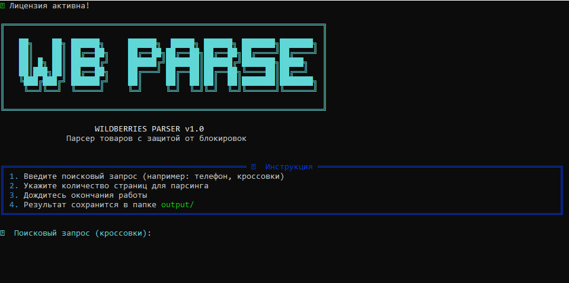
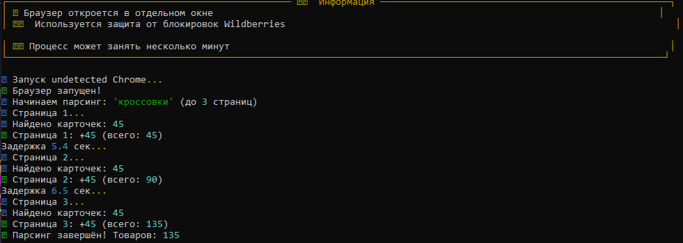
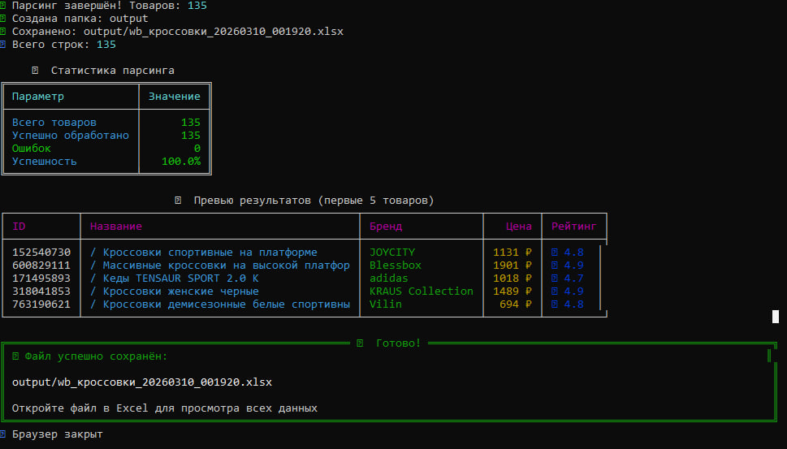
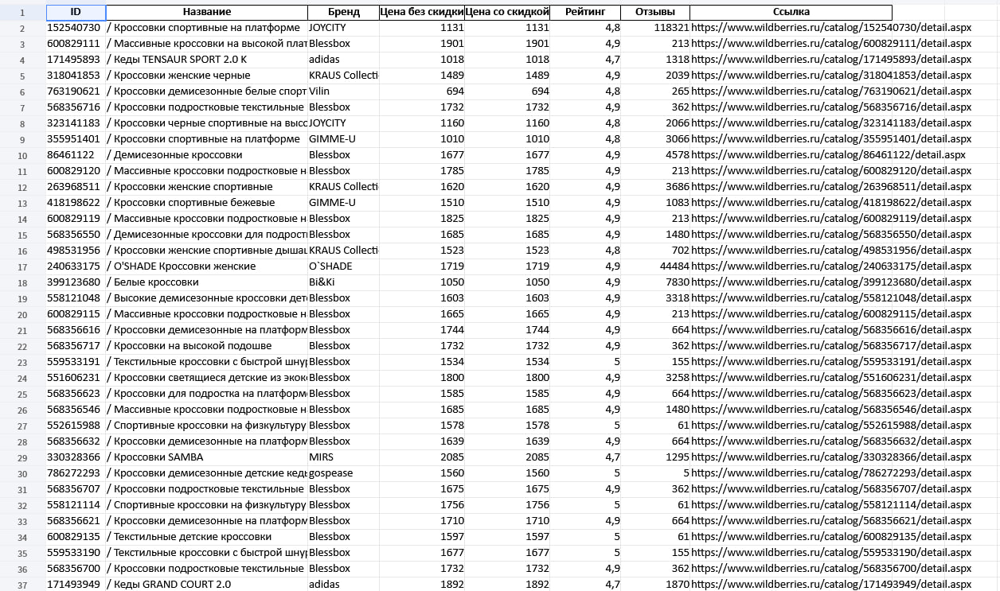

<div align="center">

# 🛒 Wildberries Parser

### Автоматический парсер товаров с Wildberries

[](https://www.python.org/downloads/)
[](LICENSE)
[](https://www.microsoft.com/windows)
[](https://github.com/YYaroslavSSolovev/wildberries-parser/releases)

**Мощный инструмент для сбора данных о товарах с обходом защиты и экспортом в Excel**

[📥 Скачать](#-скачать) • [📖 Документация](#-использование) • [🐛 Сообщить об ошибке](https://github.com/YYaroslavSSolovev/wildberries-parser/issues)

</div>

---

## 📋 О проекте

**Wildberries Parser** — это автоматизированный инструмент для сбора данных о товарах с маркетплейса Wildberries с обходом защиты от ботов.

### ✨ Возможности

| Функция | Описание |
|---------|----------|
| 🔍 **Поиск товаров** | По любому поисковому запросу |
| 📊 **Экспорт в Excel** | Готовый файл .xlsx |
| 🛡️ **Обход защиты** | Использует undetected-chromedriver |
| 🎨 **Красивый интерфейс** | Цветная консоль с Rich |
| 🔑 **Система лицензий** | Защита от пиратства |
| ⚡ **Быстрая работа** | До 100 товаров за страницу |

### 📦 Собираемые данные

| Поле | Описание |
|------|----------|
| **ID** | Артикул товара |
| **Название** | Полное название товара |
| **Бренд** | Производитель |
| **Цена без скидки** | Оригинальная цена (₽) |
| **Цена со скидкой** | Актуальная цена (₽) |
| **Скидка** | Процент скидки |
| **Рейтинг** | Средняя оценка (1-5) |
| **Отзывы** | Количество отзывов |
| **Продавец** | Название магазина |
| **Ссылка** | URL товара на WB |

---

## 💻 Системные требования

### Минимальные

| Компонент | Требование |
|-----------|------------|
| **ОС** | Windows 10/11 (64-bit) |
| **RAM** | 4 ГБ |
| **Диск** | 500 МБ свободного места |
| **Браузер** | Google Chrome (последняя версия) |
| **Интернет** | Стабильное соединение |

### Рекомендуемые

| Компонент | Требование |
|-----------|------------|
| **RAM** | 8 ГБ |
| **CPU** | 4 ядра |
| **Интернет** | 10+ Мбит/с |

---

## 📥 Скачать

### Вариант 1: Готовое приложение (Windows)

1. **Скачайте** последний релиз: [WildberriesParser_v1.0.zip](https://github.com/YYaroslavSSolovev/WBParser/releases/tag/v1.0.0)
2. **Распакуйте** архив в любую папку
3. **Запустите** `WildberriesParser.exe`
4. **Следуйте** инструкциям на экране

### Вариант 2: Из исходников (для разработчиков)

```bash
git clone https://github.com/YYaroslavSSolovev/wildberries-parser.git
cd wildberries-parser
pip install -r requirements.txt
python main_undetected.py
```

---

## 📖 Использование

### Запуск программы

1. Запустите `WildberriesParser.exe`
2. При первом запуске потребуется активация (см. раздел Активация)
3. Введите поисковый запрос (например: телефон, кроссовки)
4. Укажите количество страниц (1-10)
5. Дождитесь завершения парсинга
6. Результат сохранится в папке `output/`

### Пример работы

    ╔═══════════════════════════════════════════════════════════════╗
    ║                    WILDBERRIES PARSER v1.0                    ║
    ╚═══════════════════════════════════════════════════════════════╝

    🔍 Поисковый запрос: телефон
    📄 Количество страниц: 3

    ℹ Запуск браузера...
    ✓ Браузер запущен!
    ℹ Начинаем парсинг: 'телефон' (до 3 страниц)
    ✓ Страница 1: +100 товаров
    ✓ Страница 2: +100 товаров
    ✓ Страница 3: +100 товаров
    ✓ Парсинг завершён! Товаров: 300
    ✓ Сохранено: output/wb_телефон_20240309_153045.xlsx

    ╔════════════════ Статистика ════════════════╗
    ║ Всего товаров        │        300         ║
    ║ Успешно обработано   │        300         ║
    ║ Ошибок               │          0         ║
    ╚════════════════════════════════════════════╝

---

## 🖼️ Скриншоты

<details>
<summary>📸 Нажмите чтобы посмотреть скриншоты</summary>
<br>

### Главное меню


*Красивый интерфейс с баннером и инструкциями*

---

### Процесс парсинга


*Браузер автоматически открывается и собирает данные*

---

### Результат работы


*Подробная статистика и путь к сохранённому файлу*

---

### Excel файл


*Готовый файл с данными о товарах*

</details>

---

## 🔑 Активация

При первом запуске программа запросит лицензионный ключ:

    ═══════════════════════════════════
      ТРЕБУЕТСЯ АКТИВАЦИЯ
    ═══════════════════════════════════

    ID вашего компьютера: ABC123DEF456

    Отправьте этот ID разработчику для получения ключа.
    Telegram: [Телеграмм](https://t.me/Yaroslav_GIT)

    Введите лицензионный ключ: _

### Как получить ключ

1. **Скопируйте** свой Hardware ID из программы
2. **Отправьте** ID разработчику в Telegram
3. **Получите** лицензионный ключ
4. **Введите** ключ в программу
5. **Готово!** Активация завершена ✅

---

## 📁 Структура проекта

    wildberries-parser/
    ├── main_undetected.py       # Точка входа
    ├── parser_undetected.py     # Логика парсинга
    ├── license.py               # Система лицензирования
    ├── config.py                # Настройки
    ├── utils.py                 # Вспомогательные функции
    ├── generate_key.py          # Генератор ключей
    ├── requirements.txt         # Зависимости
    ├── icon.ico                 # Иконка
    ├── README.md                # Документация
    ├── LICENSE                  # MIT License
    ├── CHANGELOG.md             # История изменений
    ├── screenshots/             # Скриншоты
    └── output/                  # Результаты парсинга

---

## ⚙️ Настройки

Файл `config.py`:

    DELAY_MIN = 3.0    # Минимальная задержка (секунды)
    DELAY_MAX = 6.0    # Максимальная задержка (секунды)
    MAX_PAGES = 5      # Максимум страниц
    OUTPUT_DIR = "output"

| Параметр | Безопасно | Быстро | Риск блокировки |
|----------|-----------|--------|-----------------|
| DELAY_MIN | 3-5 сек | 1-2 сек | Высокий при <1 сек |
| DELAY_MAX | 6-10 сек | 2-3 сек | Высокий при <2 сек |
| MAX_PAGES | 3-5 | 10 | Средний при >10 |

---

## 🛠️ Технологии

| Технология | Версия | Назначение |
|------------|--------|------------|
| **Python** | 3.10+ | Язык программирования |
| **undetected-chromedriver** | 3.5.5 | Обход защиты от ботов |
| **Selenium** | 4.27.1 | Автоматизация браузера |
| **Pandas** | 2.2.0 | Обработка данных |
| **Rich** | 13.7.0 | Красивый интерфейс |
| **OpenPyXL** | 3.1.2 | Экспорт в Excel |
| **Nuitka** | 4.0.3 | Компиляция в .exe |

---

## 🐛 Решение проблем

<details>
<summary><b>❌ Ошибка "ChromeDriver version mismatch"</b></summary>

Обновите Chrome до последней версии или укажите версию в коде:

    self.driver = uc.Chrome(options=options, version_main=145)

</details>

<details>
<summary><b>❌ "Подозрительная активность" на сайте WB</b></summary>

- Увеличьте задержки в `config.py`
- Парсьте меньше страниц (2-3)
- Подождите 30-60 минут
- Смените IP (VPN или перезагрузка роутера)

</details>

<details>
<summary><b>❌ Программа не находит товары</b></summary>

- Проверьте интернет
- Обновите Google Chrome
- Попробуйте другой запрос
- Перезапустите программу

</details>

<details>
<summary><b>❌ Неверный лицензионный ключ</b></summary>

- Проверьте что ключ для вашего Hardware ID
- Скопируйте ключ без пробелов
- Обратитесь к разработчику

</details>

<details>
<summary><b>❌ .exe не запускается</b></summary>

- Распакуйте ВСЮ папку (не только .exe)
- Добавьте в исключения антивируса
- Запустите от имени администратора

</details>

---

## ⚠️ Важно

- 🌐 Браузер открывается автоматически — не закрывайте вручную
- ⏱️ Не парсьте слишком часто — риск блокировки IP
- 📄 Максимум 10 страниц за один запуск
- ⏳ Пауза между запусками: 10-15 минут
- 🔒 Лицензия привязана к компьютеру

---

## 📝 Планы развития

- [ ] Парсинг по URL категории
- [ ] Фильтры (цена, бренд, рейтинг)
- [ ] Экспорт в CSV/JSON
- [ ] GUI интерфейс
- [ ] Многопоточность
- [ ] Поддержка прокси
- [ ] Мониторинг цен
- [ ] Поддержка macOS/Linux

---

## 📄 Лицензия

MIT License — см. [LICENSE](LICENSE)

---

## 👨‍💻 Автор

**Ярослав Соловьев**

- 💬 Telegram: [@Мой Телеграмм](https://t.me/Yaroslav_GIT)
- 📧 Email: reikonogig@email.com
- 🐙 GitHub: [Мой Гитхаб](https://github.com/YYaroslavSSolovev)

---

⭐ **Если проект полезен — поставьте звезду!**

<div align="center">

**Сделано с ❤️ и Python**

</div>
